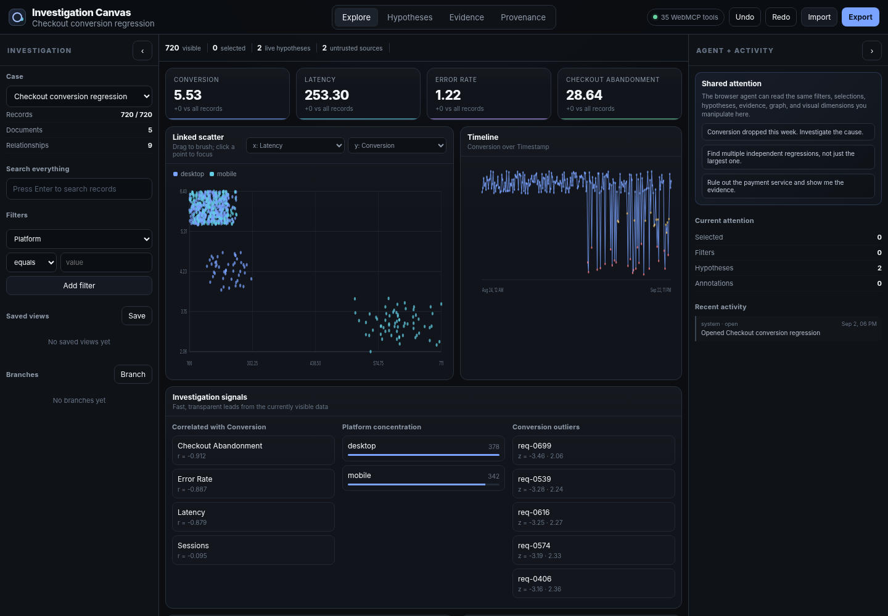

# Investigation Canvas

**A shared visual reasoning workspace for people and WebMCP agents.**



Investigation Canvas lets a person explore records, charts, evidence, relationships, and competing hypotheses while a browser agent works with the exact same application state. A human can select an anomalous cluster; the agent can retrieve those precise records, compare them with the rest, open relevant evidence, test alternative explanations, and leave its work visible in the canvas and provenance trail.

## Why WebMCP

Visual investigation interfaces are useful to people but difficult for agents to interpret reliably from pixels or DOM structure. Investigation Canvas exposes the semantic objects already known by the application—records, selections, filters, evidence, hypotheses, findings, and canvas views—through WebMCP tools.

The tools are registered with the imperative browser API:

```js
await document.modelContext.registerTool({
  name: "get_selection",
  description: "Return the records currently selected by the human.",
  inputSchema: { type: "object", properties: {}, additionalProperties: false },
  execute: async () => ({
    recordIds: store.state.selection,
    records: store.getSelectedRecords()
  })
});
```

The complete implementation is in [`investigation-canvas/src/webmcp.js`](investigation-canvas/src/webmcp.js). Agent mutations use the same store that renders the interface, so selections, evidence, hypotheses, and findings remain inspectable by the person.

## Try it locally

```bash
npm start
```

Then open <http://localhost:4173>. WebMCP tool registration requires ChatGPT's in-app browser or a compatible Chrome configuration; the visual workspace remains usable in an ordinary browser.

For the clearest demonstration, keep the built-in **Checkout conversion regression** case selected and ask:

> Conversion dropped this week. Investigate the cause. Maintain at least two competing hypotheses, show me the evidence visually, and try to falsify your leading explanation before concluding.

## Testing

```bash
npm test
```

The repository also includes real-browser E2E, responsive-layout, visual screenshot, and full WebMCP tool-contract verification. The current detailed suite contains 147 tests, and the browser verifier registers and invokes all 48 exposed tools against deterministic sample investigations.

## Project layout

- [`investigation-canvas/`](investigation-canvas/) — static application, application documentation, tests, and assets
- [`investigation-canvas/docs/SUBMISSION.md`](investigation-canvas/docs/SUBMISSION.md) — hackathon submission draft
- [`investigation-canvas/docs/DEMO.md`](investigation-canvas/docs/DEMO.md) — under-three-minute demo outline
- [`ci/visual/`](ci/visual/) — Playwright visual regression harness
- [`recovery/`](recovery/) — browser verification and recovery artifacts

More implementation detail is available in the [application README](investigation-canvas/README.md) and [architecture notes](investigation-canvas/docs/ARCHITECTURE.md).

## License

[MIT](LICENSE)
